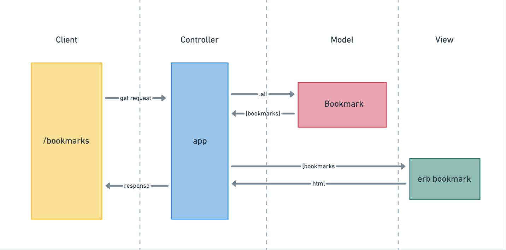

# Bookmark Manager

This was the week 4 weekly challenge from Makers. The task was to build a web app that stores web bookmarks in a database.

### User story for showing a list of bookmarks

```
As a user,
So that I can quickly visit my favourite websites,
I'd like the Bookmark Manager to display a list of bookmarks on its homepage
```

### Domain model



To set up the database from scratch, do the following:

1. Connect to psql, using the command psql postgres
2. Create the database using the psql command CREATE DATABASE bookmark_manager;
3. Connect to the database using the pqsl command \c bookmark_manager;
4. Run the query just saved in the file 01_create_bookmarks_table.sql

### User story for addingbookmarks

```
As a user
So that I can save a website
I would like to add the site's address and title to bookmark manager
```

### To set the database up from scratch

```
Connect to psql
Create the database using the psql command CREATE DATABASE bookmark_manager;
Connect to the database using the pqsl command \c bookmark_manager;
Run the query saved in db/migrations/01_create_bookmarks_table.sql
```
